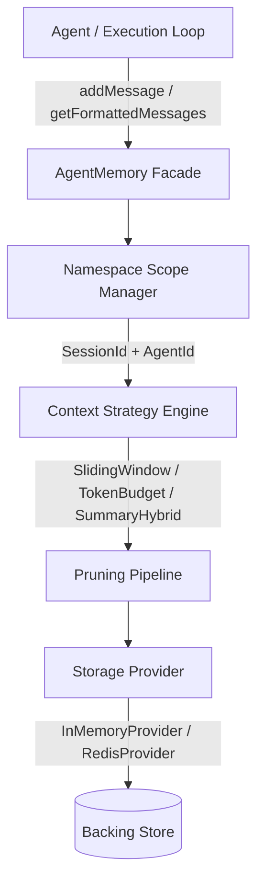

# Agent Memory & Context Manager Subsystem (`agents/memory`)

A pluggable, TypeScript-based memory and context window management subsystem for BugBaar Engine. It provides decoupled storage backends, context window pruning strategies, and multi-agent namespace isolation.

---

## Overview

Managing agent conversational history across LLM orchestration loops presents recurring technical challenges:
1. **Context Window Limits**: Message history eventually exceeds model token limits.
2. **Infrastructure Coupling**: Requiring external databases for local development creates unnecessary friction.
3. **Multi-Agent State Collision**: Concurrent agents in a shared session can overwrite or leak state across execution loops.
4. **Tool Call Invariants**: LLM APIs require tool results to directly correspond to an assistant tool-call message. Naive truncation that prunes the assistant call while leaving the tool result produces an invalid message sequence (HTTP 400).

This subsystem addresses these issues by decoupling storage drivers from context pruning algorithms using the Provider and Strategy design patterns.

---

## Architecture

The subsystem separates persistence from context preparation:



---

## Directory Structure

```text
agents/memory/
├── interfaces/
│   ├── message.interface.ts     # BaseMessage models & Zod schemas
│   ├── provider.interface.ts    # IMemoryProvider contract & MemoryNamespace definition
│   └── strategy.interface.ts    # IContextStrategy contract & StrategyOptions
├── providers/
│   ├── in-memory.provider.ts    # Default in-memory store
│   └── redis.provider.ts        # Redis store adapter with fallback
├── strategies/
│   ├── sliding-window.strategy.ts # Count-based message window pruning
│   ├── token-budget.strategy.ts   # Token-budget pruning + tool call sanitization
│   └── summary-hybrid.strategy.ts # Context condensation + recent message retention
├── utils/
│   └── token-counter.util.ts    # Character-to-token estimator
├── agent-memory.ts              # Primary facade with fallback handling
├── index.ts                     # Public barrel export
└── __tests__/
    ├── agent-memory.test.ts     # Integration and contract tests
    └── realtime-scenarios.test.ts # ReAct chains, concurrency, and fault tolerance tests
```

---

## Core Components

| Component | Responsibility | Key Files |
| :--- | :--- | :--- |
| **Interfaces** | Strongly typed message models (`User`, `Assistant`, `System`, `Tool`), Zod validation schemas, and provider/strategy contracts. | `interfaces/*.ts` |
| **Providers** | Raw message persistence. Includes `InMemoryProvider` (default) and `RedisProvider` (for distributed deployments). | `providers/*.ts` |
| **Strategies** | Algorithms for formatting and pruning messages before LLM invocation. Enforces token bounds and tool call pair integrity. | `strategies/*.ts` |
| **Utils** | Fast heuristic token estimation without native binary dependencies. | `utils/token-counter.util.ts` |
| **Facade (`AgentMemory`)** | Public API managing namespace routing, strategy execution, and fallback handling. | `agent-memory.ts` |

---

## Technical Features

### 1. Tool Call Pair Integrity
OpenAI and Anthropic APIs mandate that every `role: 'tool'` message must be preceded by an `assistant` message containing the matching `toolCallId`. Both `TokenBudgetStrategy` and `SlidingWindowStrategy` run `sanitizeToolCallPairs()` to remove orphaned tool outputs if their parent call was pruned.

### 2. Dual-Namespace Scoping (`sessionId` + `agentId`)
Prevents cross-agent memory contamination:
* **Private Agent Memory**: Use `{ sessionId: 'user-1', agentId: 'planner' }`.
* **Shared Session Memory**: Omit `agentId` to read/write to the common session buffer (`{ sessionId: 'user-1' }`).
* All keys are encoded (`session:<id>|agent:<id>`) to prevent delimiter collisions.

### 3. Graceful Fallback Handling
Memory operations are structured to prevent runtime exceptions from breaking host agent loops:
* **Storage Outage**: If `RedisProvider` encounters a connection failure, writes route to an internal fallback store and are reconciled upon read.
* **Malformed Payloads**: Invalid message schemas caught by Zod are logged and omitted without crashing.
* **Pruning Failure**: If a custom summarizer throws an error, the system falls back to `TokenBudgetStrategy`.

---

## Usage Examples

### 1. Default Setup
```typescript
import { AgentMemory } from './agents/memory';

const memory = new AgentMemory();

await memory.addMessage({ role: 'user', content: 'What is the placement drive status?' });
await memory.addMessage({ role: 'assistant', content: 'Drives are active.' });

const messages = await memory.getFormattedMessages();
```

### 2. Tool Calls and Tool Results
```typescript
import { AgentMemory } from './agents/memory';

const memory = new AgentMemory();

await memory.addMessage({
  role: 'assistant',
  content: 'Running database query...',
  toolCalls: [{
    id: 'call_101',
    name: 'queryPlacementDB',
    arguments: '{"status":"open"}'
  }]
});

await memory.addMessage({
  role: 'tool',
  toolCallId: 'call_101',
  content: '{"results":["CompanyA","CompanyB"]}'
});
```

### 3. Redis Provider with Custom Token Budget
```typescript
import { 
  AgentMemory, 
  RedisProvider, 
  TokenBudgetStrategy 
} from './agents/memory';

const memory = new AgentMemory({
  provider: new RedisProvider({ host: 'localhost', port: 6379 }),
  strategy: new TokenBudgetStrategy(4000),
  namespace: {
    sessionId: 'session-2026',
    agentId: 'researcher-agent'
  }
});
```

---

## Verification & Testing

The test suite contains 14 automated tests covering message contracts, token bounding, tool call sanitization, concurrent multi-agent operations, and storage fault recovery.

```bash
# Run unit and integration tests
npm test

# Run single-agent demonstration
npm run demo

# Run multi-agent simulation demonstration
npm run demo:advanced
```

---

## Extending the Subsystem

### Custom Storage Provider
Implement the `IMemoryProvider` interface:
```typescript
import { IMemoryProvider, MemoryNamespace, BaseMessage } from './agents/memory';

export class CustomDatabaseProvider implements IMemoryProvider {
  async saveMessage(namespace: MemoryNamespace, message: BaseMessage): Promise<void> { /* ... */ }
  async getMessages(namespace: MemoryNamespace): Promise<BaseMessage[]> { /* ... */ }
  async clear(namespace: MemoryNamespace): Promise<void> { /* ... */ }
}
```

### Custom Pruning Strategy
Implement the `IContextStrategy` interface:
```typescript
import { IContextStrategy, StrategyOptions, BaseMessage } from './agents/memory';

export class CustomPruningStrategy implements IContextStrategy {
  async prune(messages: BaseMessage[], options?: StrategyOptions): Promise<BaseMessage[]> {
    return messages;
  }
}
```
